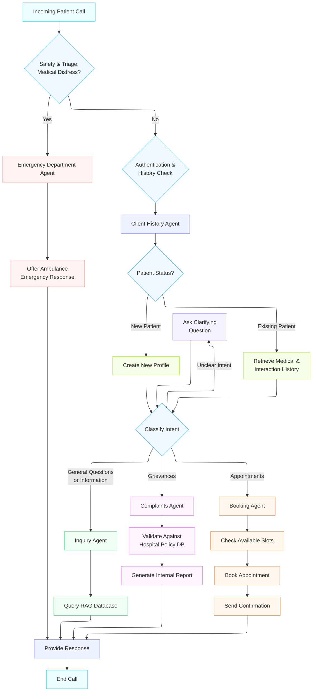

# Technical Architecture — Al-Mokala Hospital Intelligent Call Center

---

## 1. Overview

Al-Mokala Hospital Intelligent Call Center is a **hierarchical multi-agent AI system** that handles patient calls end-to-end: it triages by medical urgency, authenticates the caller, classifies intent, and routes to a specialized sub-agent — all while maintaining clinical-grade tone and full patient context.

**Core problems solved:**

- Variable urgency — a single call may be routine or life-threatening; misclassification has direct safety consequences.
- High call volume — manual routing creates bottlenecks.
- Context fragmentation — patient history scattered across systems forces callers to repeat themselves.

**Architectural style:** A single Supervisor Agent owns the call lifecycle and delegates to four specialist sub-agents. No sub-agent talks directly to another. Call state is persisted externally so any worker can resume a session after a crash.

---

## 2. Technology Stack

> ✅ = Recommended default

| Layer | ✅ Recommended | Alternatives |
| ----- | -------------- | ------------ |
| Language | Python 3.11+ | — |
| Package manager | uv | Poetry |
| Agent orchestration | LangGraph | CrewAI, AutoGen |
| LLM — Supervisor | OpenAI GPT-4o | Claude 3.5 Sonnet, Azure OpenAI |
| LLM — Sub-agents | OpenAI GPT-4o-mini | GPT-4o, Claude 3 Haiku |
| Telephony | Twilio | Vonage, AWS Connect |
| STT | OpenAI Whisper | Google STT, Deepgram |
| TTS | ElevenLabs | OpenAI TTS, Azure TTS |
| Embeddings | text-embedding-3-small | Cohere Embed, BGE-large |
| Vector DB | Qdrant (self-hosted) | Pinecone, pgvector |
| Primary DB | PostgreSQL 16 | MySQL 8 |
| ORM / migrations | SQLAlchemy + Alembic | — |
| Cache / session | Redis 7 | — |
| API framework | FastAPI | Flask |
| Dev environment | Docker Compose | — |
| Production | Kubernetes on AWS EKS | GCP GKE, Azure AKS |
| CI/CD | GitHub Actions + Helm | GitLab CI, ArgoCD |
| Secrets | AWS Secrets Manager | HashiCorp Vault |
| Logging | structlog → JSON | loguru |
| Metrics | Prometheus + Grafana | Datadog |
| Tracing | OpenTelemetry + Jaeger | Datadog APM |
| LLM tracing | LangSmith | Weights & Biases |
| Alerting | PagerDuty | OpsGenie |

---

## 3. Architecture Diagram



---

## 4. Agent Orchestration (LangGraph)

LangGraph models the call as a **directed state graph**: each node is an agent function, each edge is a conditional routing decision. This maps directly onto the diagram above.

**Graph structure:**

```text
START
  └─► triage_node       (GPT-4o — safety check)
        ├─[distress]──► emergency_node            → END
        └─[safe]──────► history_node              (GPT-4o-mini)
                            └─► intent_node        (GPT-4o — classification)
                                  ├─[inquiry]────► inquiry_node    → END
                                  ├─[complaint]──► complaint_node  → END
                                  ├─[booking]────► booking_node    → END
                                  └─[unclear]────► clarify_node ──► intent_node
```

**Shared call state (`CallState`)** flows through every node:

```python
class CallState(TypedDict):
    call_id: str
    caller_phone: str
    audio_transcript: str
    triage_result: Literal["emergency", "safe"]
    patient_id: Optional[str]
    patient_status: Literal["new", "existing", "unknown"]
    history_summary: Optional[str]
    intent: Optional[Literal["inquiry", "complaint", "booking", "unclear"]]
    clarification_count: int
    agent_response: Optional[str]
    messages: list[dict]
```

State is checkpointed to Redis after every node via `AsyncRedisCheckpointer`, enabling crash recovery across worker restarts.

---

## 5. LLM Configuration

**Model assignment:** The Supervisor and Emergency Agent use GPT-4o (safety-critical reasoning). All other sub-agents use GPT-4o-mini (lower cost, adequate for structured tool use).

**Prompt structure (layered, per agent):**

```text
[1] IDENTITY     — agent name and hospital context
[2] SCOPE        — exact responsibility; what NOT to do
[3] TOOLS        — list of available tool functions
[4] PATIENT CTX  — patient_id, status, history summary (injected per call)
[5] HISTORY      — last N conversation turns (sliding window, max 8 000 tokens)
[6] CURRENT TURN — caller transcript
```

Prompts are versioned files in `prompts/` and hot-reloadable without redeployment. Message history is trimmed to the most recent turns when the token budget is exceeded.

---

## 6. Voice Pipeline (STT / TTS)

**End-to-end audio flow:**

```text
PSTN → Twilio Media Stream (WebSocket) → api-gateway
     → STT (Whisper API, ~500 ms)
     → agent-worker (LangGraph, ~1 500 ms)
     → TTS (ElevenLabs streaming, ~400 ms first chunk)
     → api-gateway → Twilio → PSTN
```

**Target latencies:**

| Stage | p50 | p99 |
| ----- | --- | --- |
| STT transcription | 500 ms | 2 000 ms |
| Agent processing | 1 500 ms | 3 000 ms |
| TTS first chunk | 400 ms | 800 ms |
| **End-to-end** | **< 2 600 ms** | **< 5 000 ms** |

**Whisper** is chosen for STT because of first-class Arabic support. **ElevenLabs** is chosen for TTS because of the most natural voice quality in both Arabic and English with low streaming latency. Audio format is 8-kHz µ-law, chunked at 20 ms intervals (Twilio Media Stream protocol).

---

## 7. RAG Implementation

The Inquiry Agent answers general questions and the Complaints Agent validates policies — both rely on the RAG pipeline.

**Ingestion pipeline:**

```text
Source docs (PDF / DOCX / web)
  → Recursive text splitter (512 tokens, 50-token overlap)
  → Metadata tagging (doc_type, department, language, updated_at)
  → Embedding model (text-embedding-3-small → 1 536 dims)
  → Qdrant upsert
```

**Retrieval strategy (hybrid):**

1. Dense retrieval — cosine similarity, top-10
2. Sparse retrieval — BM25 keyword search, top-10
3. Reciprocal Rank Fusion (RRF) — merges both lists
4. Cross-encoder re-ranking — top-5 results passed to LLM

**Qdrant collections:**

| Collection | Used by | Content |
| ---------- | ------- | ------- |
| `hospital_knowledge` | Inquiry Agent | FAQs, doctors, services |
| `hospital_policies` | Complaints Agent | Policies, bylaws |

Both use HNSW index (cosine similarity, 1 536 dims). Metadata filters restrict results by `language` and `department` at query time.

---

## 8. Agents Reference

| Agent | LangGraph Node | Model | Tools | Escalates to |
| ----- | -------------- | ----- | ----- | ------------ |
| **Supervisor** | `triage_node`, `intent_node`, `clarify_node` | GPT-4o | All sub-agents | Emergency on ambiguous distress |
| **Emergency** | `emergency_node` | GPT-4o | Emergency Dispatch API *(planned)* | — (terminal) |
| **Client History** | `history_node` | GPT-4o-mini | `lookup_patient`, `create_patient` | Supervisor |
| **Inquiry** | `inquiry_node` | GPT-4o-mini | Qdrant `hospital_knowledge` | Supervisor |
| **Complaints** | `complaint_node` | GPT-4o | Qdrant `hospital_policies`, `create_complaint_report` | Supervisor |
| **Booking** | `booking_node` | GPT-4o-mini | `query_slots`, `book_slot`, `send_confirmation` | Supervisor |

---

## 9. Routing Logic

| Step | Trigger | Action |
| ---- | ------- | ------ |
| **1 — Triage** | Every inbound call (first) | Detect medical distress → Emergency Agent (skip all other steps). When in doubt, always route to Emergency. |
| **2 — Auth** | After triage clears | Client History Agent: look up or create patient profile; inject history into `CallState`. |
| **3 — Intent** | After auth | Classify: inquiry → Inquiry Agent; complaint → Complaints Agent; appointment → Booking Agent; unclear → ask a clarifying question (max 3 loops). |

---

## 10. Data Models

**Primary store: PostgreSQL 16** (SQLAlchemy async + Alembic migrations). **Session store: Redis** (key `session:{call_id}`, TTL 30 min).

```sql
CREATE TABLE patients (
    patient_id   UUID PRIMARY KEY DEFAULT gen_random_uuid(),
    full_name    TEXT        NOT NULL,
    phone_number VARCHAR(20) NOT NULL UNIQUE,
    date_of_birth DATE       NOT NULL,
    status       TEXT        NOT NULL DEFAULT 'existing'
                 CHECK (status IN ('new', 'existing')),
    created_at   TIMESTAMPTZ NOT NULL DEFAULT now(),
    updated_at   TIMESTAMPTZ NOT NULL DEFAULT now()
);

CREATE TABLE interaction_history (
    history_id    UUID PRIMARY KEY DEFAULT gen_random_uuid(),
    patient_id    UUID        NOT NULL REFERENCES patients ON DELETE CASCADE,
    call_date     TIMESTAMPTZ NOT NULL DEFAULT now(),
    agent_handled TEXT        NOT NULL,
    summary       TEXT,
    diagnoses     TEXT[]      DEFAULT '{}'
);

CREATE TABLE complaints (
    complaint_id      UUID PRIMARY KEY DEFAULT gen_random_uuid(),
    patient_id        UUID NOT NULL REFERENCES patients,
    submitted_at      TIMESTAMPTZ NOT NULL DEFAULT now(),
    category          TEXT NOT NULL,
    description       TEXT NOT NULL,
    policy_reference  TEXT,
    resolution_status TEXT NOT NULL DEFAULT 'open'
                      CHECK (resolution_status IN ('open', 'in_review', 'resolved'))
);

CREATE TABLE appointment_slots (
    slot_id       UUID PRIMARY KEY DEFAULT gen_random_uuid(),
    doctor_id     UUID        NOT NULL,
    specialty     TEXT        NOT NULL,
    slot_datetime TIMESTAMPTZ NOT NULL,
    status        TEXT        NOT NULL DEFAULT 'available'
                  CHECK (status IN ('available', 'booked', 'cancelled')),
    patient_id    UUID REFERENCES patients,
    confirmation_token TEXT UNIQUE
);

CREATE INDEX idx_patients_phone   ON patients (phone_number);
CREATE INDEX idx_slots_available  ON appointment_slots (specialty, slot_datetime)
    WHERE status = 'available';
```

**Redis session object** (JSON, TTL 30 min):

```json
{
  "call_id": "CA...",
  "patient_id": "uuid",
  "patient_status": "existing",
  "history_summary": "...",
  "triage_result": "safe",
  "intent": "booking",
  "clarification_count": 0,
  "messages": [{ "role": "user", "content": "..." }]
}
```

At call end, the session is written to `interaction_history` in PostgreSQL and the Redis key is deleted.

---

## 11. API Design

**Framework:** FastAPI (async, auto-generates OpenAPI docs at `/docs`). All endpoints require **JWT Bearer** authentication except `/health`. Twilio webhooks are authenticated via HMAC-SHA1 request signature.

**Key endpoints:**

```text
POST   /calls/inbound                  → Twilio webhook; returns TwiML to open media stream
WS     /calls/{call_id}/stream         → Bidirectional audio (Twilio Media Stream protocol)

GET    /patients/lookup?phone={phone}  → Lookup by phone number
POST   /patients                       → Create new patient profile
GET    /patients/{id}                  → Fetch by ID

GET    /appointments/slots             → Query available slots (?specialty, ?from, ?to)
POST   /appointments                   → Book a slot { patient_id, slot_id }
DELETE /appointments/{slot_id}         → Cancel

POST   /complaints                     → Submit complaint { patient_id, category, description }

GET    /health                         → Liveness/readiness probe
GET    /metrics                        → Prometheus metrics (internal only)
```

---

## 12. Deployment

**Services (one container each):**

| Service | Role |
| ------- | ---- |
| `api-gateway` | FastAPI app; Twilio webhook + WebSocket audio |
| `agent-worker` | LangGraph engine; horizontally scalable (stateless — state in Redis) |
| `rag-service` | Embedding + Qdrant retrieval |
| `postgres` | Primary DB (Multi-AZ in prod) |
| `redis` | Session cache (Cluster in prod) |
| `qdrant` | Vector store (replicated in prod) |

**Development (Docker Compose):**

```yaml
services:
  api-gateway:
    build: ./services/api-gateway
    ports: ["8000:8000"]
    depends_on: [postgres, redis, qdrant]
  agent-worker:
    build: ./services/agent-worker
    depends_on: [postgres, redis, qdrant]
  rag-service:
    build: ./services/rag-service
    depends_on: [qdrant]
  postgres:
    image: postgres:16
  redis:
    image: redis:7-alpine
  qdrant:
    image: qdrant/qdrant:latest
```

**Production (AWS EKS):** `api-gateway` and `agent-worker` scale horizontally via Kubernetes HPA (CPU-based). `agent-worker` is stateless by design — any replica can resume any call session from Redis. Secrets are injected via External Secrets Operator from AWS Secrets Manager. CI/CD: GitHub Actions → ECR → Helm upgrade with atomic rollback.

---

## 13. Observability

**Structured logging** (structlog → JSON → CloudWatch): every log line carries `call_id`, `patient_id`, `node`, `event`, `duration_ms`. PHI is never logged — only opaque UUIDs.

**Key metrics (Prometheus):**

| Metric | Type |
| ------ | ---- |
| `calls_active` | Gauge |
| `call_duration_seconds` | Histogram |
| `emergency_routings_total` | Counter |
| `llm_request_duration_seconds` | Histogram (label: agent, model) |
| `llm_tokens_used_total` | Counter |
| `stt_latency_seconds` | Histogram |
| `tool_call_errors_total` | Counter |

**Distributed tracing:** OpenTelemetry spans cover every node execution, LLM call, tool call, and DB query. Exported to Jaeger. LangSmith used for full LangGraph agent traces in staging.

**SLOs:**

| SLO | Target |
| --- | ------ |
| Emergency routing accuracy | ≥ 99.9% |
| End-to-end response latency p99 | < 5 s |
| System availability | ≥ 99.5% |

---

## 14. Security

- **PHI / HIPAA:** All PostgreSQL volumes and Qdrant storage encrypted at rest (AES-256). All traffic encrypted in transit (TLS 1.3). Patient data never appears in logs, traces, or LLM prompt logs — opaque UUIDs only. Transcripts retained for 7 years then auto-deleted.
- **Authentication:** JWT + OAuth2. Human users → Authorization Code Flow. Services → Client Credentials Flow.
- **Secrets:** No credentials in code, images, or CI logs. All secrets in AWS Secrets Manager, rotated automatically every 90 days.
- **Network:** Only `api-gateway` is exposed externally (AWS ALB). All other services are cluster-internal. Kubernetes Network Policies restrict pod-to-pod traffic.
- **Rate limiting:** 60 requests/min per IP on the Twilio webhook. Max 50 LLM calls per call session.
- **Audit log:** Every read/write of patient data is appended to an immutable `audit_log` table (append-only; deletion requires a privileged DB role).

---

## 15. Scalability & Fault Tolerance

- **Horizontal scaling:** `agent-worker` is stateless — all session state lives in Redis, so any replica handles any call. HPA scales workers on CPU and queue depth.
- **Circuit breakers:** Wrap all external dependencies (LLM, STT, TTS, DB). On LLM circuit open: inform caller of brief delay and retry. On TTS failure: fall back to secondary TTS provider.
- **Retry policy:** Exponential backoff with jitter, max 3 attempts, cap 30 s. Failed tool calls after retries go to a dead-letter queue (SQS FIFO) for manual replay.
- **DB resilience:** PostgreSQL Multi-AZ (< 60 s failover). Redis Cluster (3 primary + 3 replica). Qdrant with replication factor 2.

---

## 16. Design Decisions

| Decision | Rationale |
| -------- | --------- |
| LangGraph over CrewAI / AutoGen | Conditional edge model maps directly to the routing diagram; built-in Redis checkpointing for crash recovery |
| Safety triage runs first | A life-threatening call must never be delayed by routine authentication or intent classification |
| Supervisor-only coordination | No peer-to-peer agent communication — prevents scope creep and simplifies audit trails |
| Redis for session state | Sub-millisecond access, built-in TTL, atomic ops; too fast-changing for PostgreSQL, too ephemeral for it to be correct |
| PHI-first design | HIPAA compliance is structural, not a retrofit — PHI exclusion is enforced at the logging and tracing layer |
| No hallucination policy | Agents answer only from their assigned tools; speculation outside tool scope is forbidden |

---

## 17. Future Extensions

| Extension | Priority |
| --------- | -------- |
| Live ambulance dispatch API integration | High |
| Human escalation path (transfer to live operator after 3 clarification loops) | High |
| Full Arabic STT / TTS parity | Medium |
| Real-time sentiment analysis for early distress detection | Medium |
| Post-call satisfaction survey pipeline | Low |
| Real-time supervisor dashboard (live call routing view) | Low |
| LLM fine-tuning on hospital call corpus | Low |

---

## 18. Glossary

| Term | Definition |
| ---- | ---------- |
| **LangGraph** | Python library for stateful, graph-based multi-agent workflows; nodes are agent functions, edges are routing decisions |
| **CallState** | Typed dict shared across all LangGraph nodes; carries patient context, routing decisions, and conversation history |
| **RAG** | Retrieval-Augmented Generation — retrieves relevant documents before generating a response to ground the output in facts |
| **HNSW** | Hierarchical Navigable Small World — the approximate nearest-neighbour index algorithm used by Qdrant |
| **STT / TTS** | Speech-to-Text / Text-to-Speech — converts caller audio to text and agent text back to audio |
| **HPA** | Horizontal Pod Autoscaler — Kubernetes controller that scales replica count based on CPU or custom metrics |
| **PHI** | Protected Health Information — patient-identifiable data covered by HIPAA (names, DOB, diagnoses, contact details) |
| **SLO** | Service Level Objective — a measurable reliability or performance target (e.g. p99 latency < 5 s) |
| **Circuit breaker** | Pattern that stops requests to a failing dependency for a cool-down period to prevent cascading failures |
| **RRF** | Reciprocal Rank Fusion — algorithm for merging ranked results from dense and sparse retrieval into one list |
